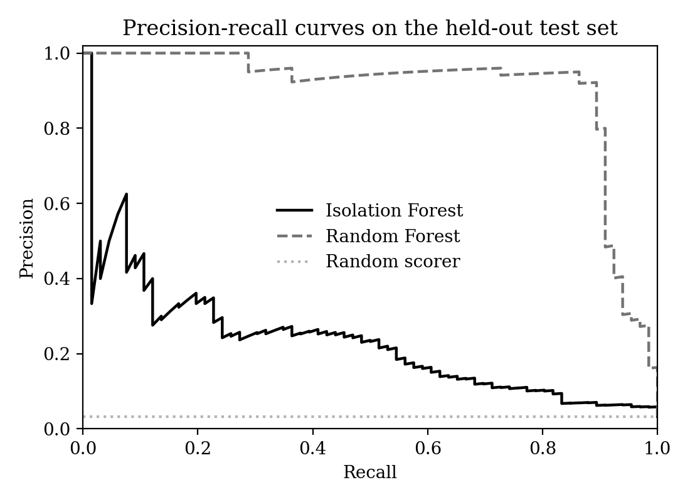

# Predictive Maintenance: Sensor Data Pipeline and Anomaly Scoring

An end-to-end pipeline on the public UCI AI4I 2020 Predictive Maintenance dataset: validated
ingestion, a SQL schema with SQL-based feature engineering, an unsupervised anomaly detector
and a supervised baseline, and a small Flask application that scores new readings.

**Data note.** The dataset is synthetic (10,000 records, about 3.4% failures) and its failures
follow fixed rules. Results show how the pipeline and models behave, not how they would perform
on real equipment.

## Pipeline

1. **Ingestion and validation.** Column standardisation, null, duplicate and range checks, and a
   label-consistency check. 27 of 10,000 rows (0.27%) had `machine_failure` disagreeing with their
   failure-mode flags (18 flagged with a mode but marked healthy, 9 marked failed with no mode)
   and were excluded.
2. **SQL layer (SQLite).** Sensor readings and failure labels are stored in separate tables
   (`readings`, `failures`) with constraints and an index. Features are derived in SQL:
   temperature difference, mechanical power, and a torque-times-wear strain term.
3. **Models (trained in Google Colab).**
   - Isolation Forest fitted on normal records only. The alert threshold is calibrated on held-out
     normal data for a 5% false-alarm rate, so no failure labels are needed.
   - Random Forest as a supervised baseline.
4. **Serving (Flask).** Input validation, the same feature computation as in training, scoring with
   both models, a JSON API, and request logging to SQLite.

## Results (held-out test set)

| Model | ROC-AUC | Avg. precision | Precision | Recall | F1 |
|---|---|---|---|---|---|
| Isolation Forest (normal-only) | 0.860 | 0.234 | 0.253 | 0.364 | 0.298 |
| Random Forest (supervised) | 0.992 | 0.903 | 0.921 | 0.879 | 0.899 |



Recall by failure mode (the number of test cases is in parentheses):

| Failure mode | Isolation Forest | Random Forest |
|---|---|---|
| Heat dissipation (25) | 0.12 | 0.96 |
| Power (16) | 0.69 | 1.00 |
| Overstrain (21) | 0.62 | 1.00 |
| Tool wear (7) | 0.00 | 0.00 |
| Random (0) | not evaluable | not evaluable |

## Limitations

- The supervised score is high largely because the engineered features encode the rules that
  generate failures in this synthetic dataset.
- The unsupervised detector is weak overall (average precision 0.234). It detects failures that
  push power or strain to extremes (recall 0.69 and 0.62) but largely misses heat-dissipation
  failures (0.12), which stay within the normal operating range. Neither model detected any of
  the 7 tool-wear failures in the test set; with so few cases, this shows only that no signal was
  found.
- The test set contains no random failures, and the per-mode counts are small, so the per-mode
  figures are indicative rather than precise.
- The dataset has no timestamps, so there is no temporal modelling or drift monitoring.

## Run locally

```
pip install -r requirements.txt
python app.py
```

Then open http://127.0.0.1:5000. The models were trained with scikit-learn 1.6.1, so the version
is pinned in `requirements.txt`.

JSON API (PowerShell):

```
Invoke-RestMethod -Uri http://127.0.0.1:5000/api/score -Method Post -ContentType "application/json" -Body '{"type":"M","air_temperature":298.1,"process_temperature":308.6,"rotational_speed":1551,"torque":42.8,"tool_wear":0}'
```

## Tests

```
pip install -r requirements-dev.txt
pytest -q
```

The tests check that the SQL features used in training match the Python features used in
serving, that invalid inputs are rejected, and that the API behaves as expected.

## Repository layout

```
app.py                  Flask application and scoring logic
templates/index.html    Web interface
model_bundle.joblib     Trained models, feature list and threshold
metrics.json            Held-out test metrics shown in the app
notebook/               Colab notebook: ingestion, SQL, training, evaluation
tests/                  pytest suite
```

## Data

AI4I 2020 Predictive Maintenance Dataset, UCI Machine Learning Repository (CC BY 4.0).
